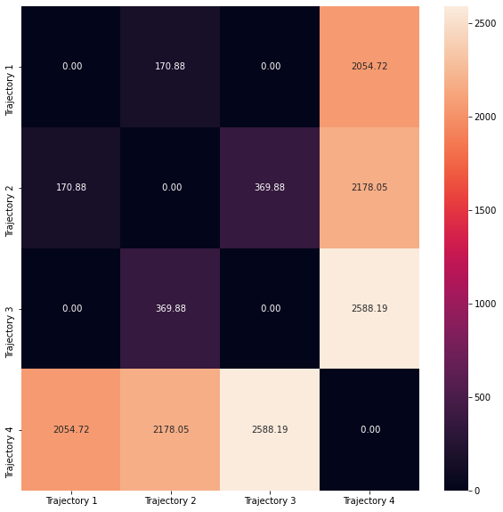

# trajectories_distance
This repository provides an implementation of the distance metric between 2D trajectories.

The metric must have the following properties:

* trajectory 3 and trajectory 1 must match;
* trajectory 2 and trajectory 1 should differ slightly;
* trajectory 4 and trajectories 1, 2, and 3 should differ significantly.

Results:

